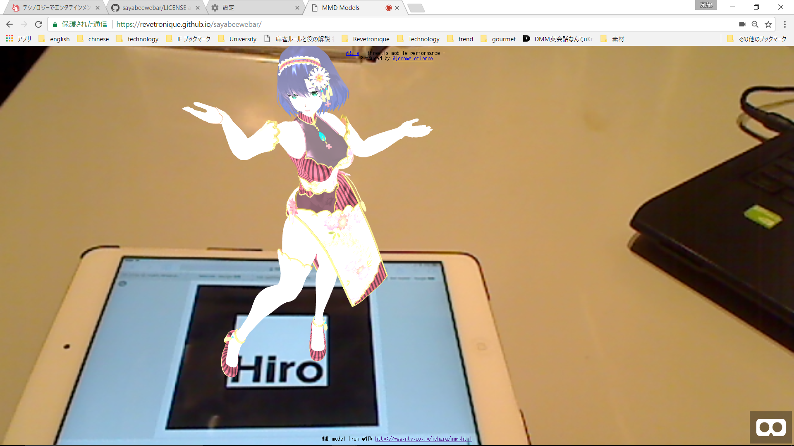

# SayabeeWebAR
A test webpage for providing an AR content with ar.js.

# Just Opening the Website on your Browser
You can try it only if jump to [Sayabee WebAR page](https://revetronique.github.io/sayabeewebar/).  
  
After opening the page, hold a [Hiro Marker](https://github.com/Revetronique/sayabeewebar/blob/master/data/Hiro%20pattern%20with%20border.pdf) in front of the webcam embedded on your device and you can see "Sayabee" mmd model dancing on the marker.

## Requirement
Your device are necessary to satisfy the following conditions.
* Windows or Android OS installed
* Google Chrome or FireFox (Recommended)
* Camera Device embedded (or you need to connect a Webcam if it's not)
* Internet access

## Browser Test
Suppose that using Windows 10 (64 bit) PC  

|Condition|Result|  
|:--|:--:|  
|Google Chrome 59.0|works|  
|Mozilla FireFox 54.0|works (it seems rendering with high frame rate)|  
|Vivaldi 1.10|works|  
|Microsoft Edge|works (but too slow!)|  
|Internet Explorer 11|doesn't work|  

If you want to know the result for other setting, 
check the paragraph "Browser Support" in the [Readme](https://github.com/jeromeetienne/AR.js/blob/master/README.md) of the AR.js official page.

# Licenses
* HTML source  
**MIT License**  
index.html is free to use for any purposes.  
For legal details, be sure to check [LICENSE](https://github.com/Revetronique/sayabeewebar/blob/master/docs/LICENSE, "License of HTML file").  
  
* MMD model and motion  
**Creative Commons (CC BY-NC 4.0)**  
The rights of utilizing the 3DCG and motion data shall be subject to [Creative Commons Attribute 4.0](https://choosealicense.com/licenses/cc-by-4.0/#), that is, 
if you comply with the 2 terms: (a)giving appropriate credit and (b)not using for commercial purpose, you can feel free to use these materials.  
[Summary of CC BY-NC 4.0](https://creativecommons.org/licenses/by-nc/4.0/) describes the rights, terms, and notices of this license.
  
# Credits
3DCG model and motion data is provided by &#169;NTV.  
  
# Notes
## Who is "Sayabee"?
Her real name is Sahya Kobayashi, and "Sayabee" is her nickname.  
She is a virtual Japanese pop idol created in a tv program "Ai-Chara(アイキャラ)" which is broadcasted by NTV (NIPPON TV).  
  
In this TV program, its MC members: BAKARHYTHM, Keisuke Koide (Base Ball Bear), and Nemu Yumemi (Dempagumi.inc) talked who are japanese pop idol characters they prefer to create,  
and decided her attributes are *28 years old and late-bloomer* on Jan. 13, 2016.  
Then they called for entry the original picture of her visual to the audience, and only a week later select the image from all entries.  
At the same time they also decided her name "Sahya Kobayashi" and other detailed characteristics.  
  
After her key visual and characteristics are settled, MC and production crews held the audition of her character voice (for amateurs only)
and ordered a famous 3DCG creator "Kio" to make her 3DCG model and animation with MMD (MikuMikuDance).  
Furthermore, tv crews had a plan to **produce her debut sing and music video**, 
therefore they requested producer Kota OhKouchi and composer and lyricist Tomoharu Moriya to her song, 
and choreographer Yumiko to her dance, whom they considered the best members.  
  
Finally, on Mar. 30, 2016, they completed to make her debut song and music video.
Of course, her voice actor, who had passed the audition, recorded her singing voice with some signature phrases.
Her debut song was actually sold via online store.  
  
Now she is making her much effort to become a famous pop idol, let's cheer her so that her dream comes true.  
For more information, check the [Officital Page](http://www.ntv.co.jp/ichara/, "Ai-Chara official") just now (sorry, it's Japanese Only).
  
## What is the TV program "Ai-Chara(アイキャラ)"
This is a Japanese TV program broadcasted by NTV (NIPPON TV).  
The ultimate purpose is creating and fostering our ideal virtual Japanese pop idols we imagine (called "Nijigen Characters"),
and making their debut into the real world.
